# Prerequisites

## Download and install tailscale client

- https://tailscale.com/download

### Setup tailscale client
-  Replace KEY with the key you got from your instructor.
```powershell
tailscale up --login-server=https://headscale.jazziro.com --authkey=KEY --accept-dns=false --accept-routes
```

# Launching VM

### Go to <http://192.168.1.11:8080> login with student user

username: student<br>
password: student

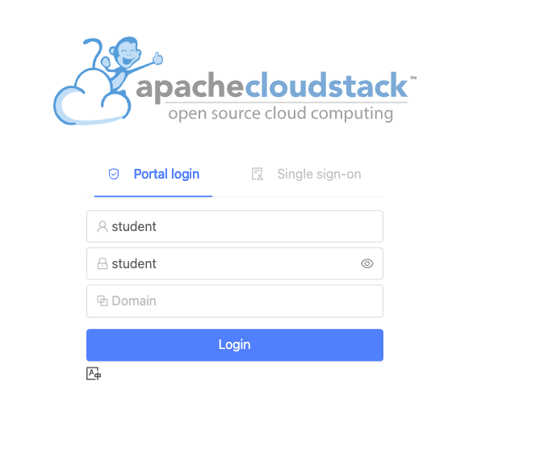

- Once logged in, from the left navigation menu go to ***Compute -> Instances***, and click on **Add Instance**

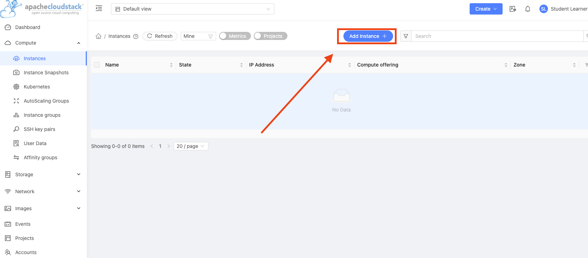

## Add the following configurations for your vm

#### 1. Select deployment infrastructure (Leave as is)

- zone1

#### 2. Template/ISO

- Ubuntu Server 24.04 LTS (Noble Numbat)

#### 3. Compute offering

- Small Instance

#### 4. Data disk

- No thanks

#### 5. Networks (Leave as is)

- mynet

#### 6. SSH key pairs (Skip)

#### 7. Advanced mode (Skip)

#### 8. Details

- Please fill in your name in the **Name** field.
- Please select **Standard (US) keyboard** from the keyboard language drop down list.

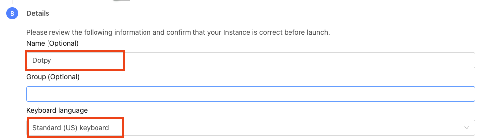

### Before proceeding to the next steps make sure your vm settings match with the following:

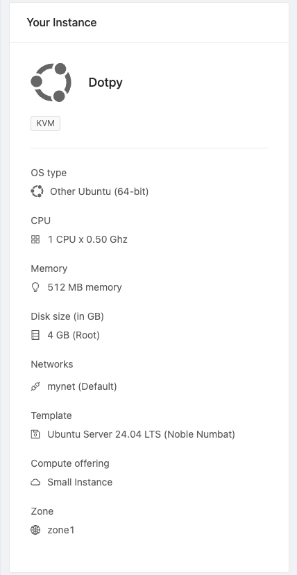

### Click **Launch Instance**


### Once your instance is running open the *view console*

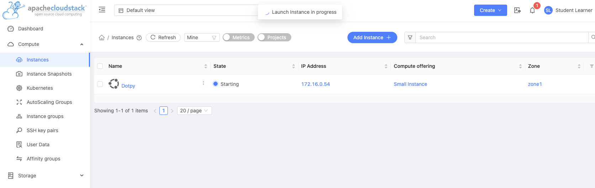
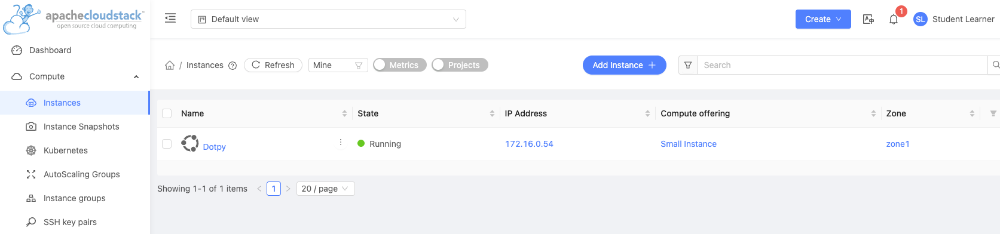
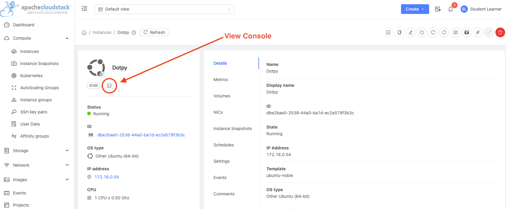

### Login to your vm using the following credentials:

- username: cloud
- password: cloud

#### Run the bellow command to confirm your vm has internet acces:
```bash
ping google.com -c 2
```
You should result with `0% packet loss`:
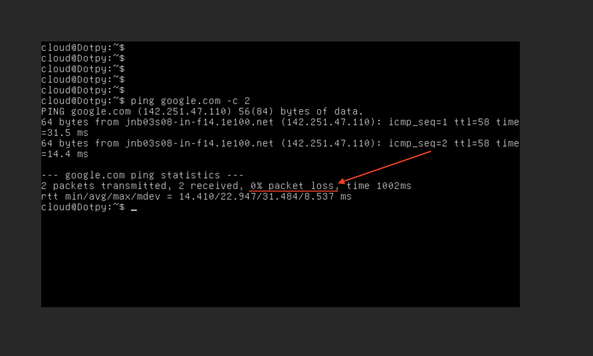
If you are getting the same results as above, you're good move on to the next steps!
# Setup Networking

### From the left navigation menu, go to Network -> Guest Networks

### Open mynet, select the *Public IP addresses* panel, and click on *Acquire new IP*

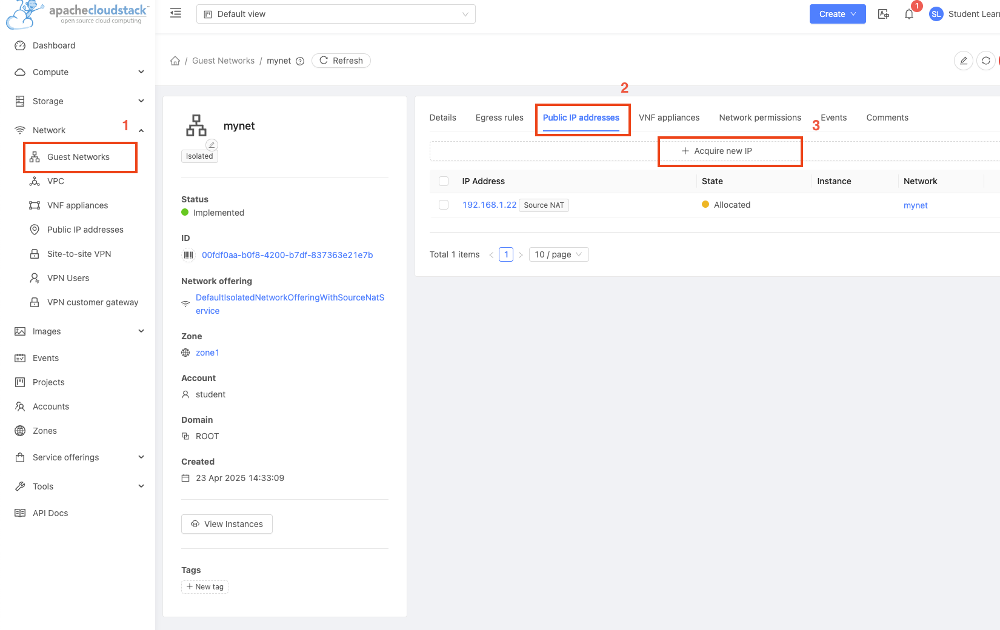

### Pick the next available IP and write down the ip number, this will be used in the next steps

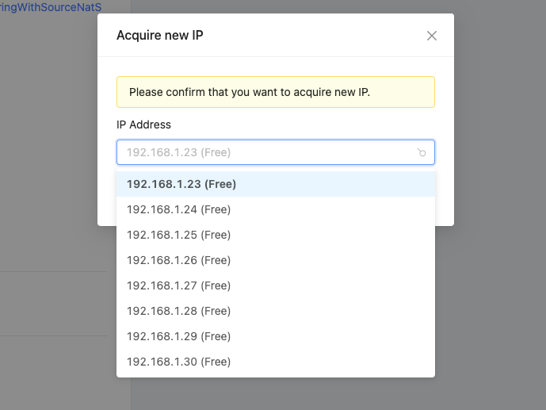

### Click the ip you selected in the previous step

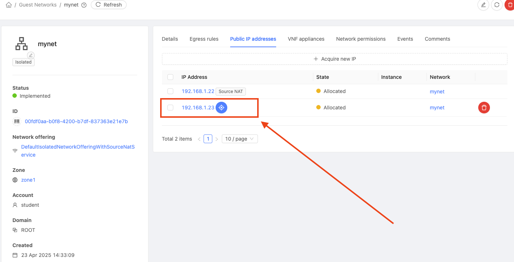

## Configure your *Firewall* and *Port forwarding* to match the followng

## Port forwarding

- Add port 22 on all fields and click on the Add Instance button *Add*.

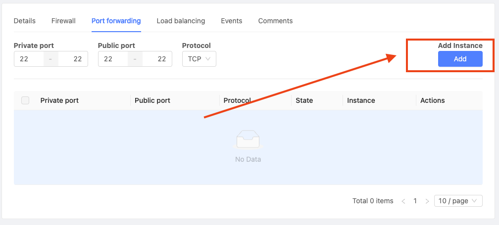

- Make sure to select the instance you created earlier that has your name.

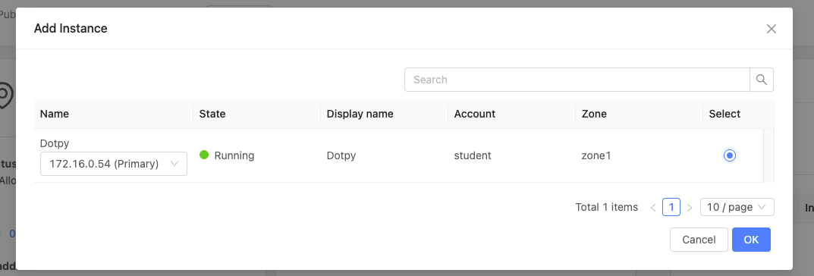

### Repeat the two previous steps but for port 80

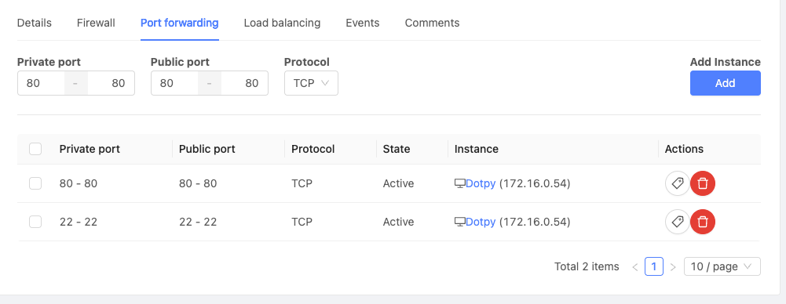

## Firewall

- protocol = TCP
- start port = 22
- end port = 22
- click add

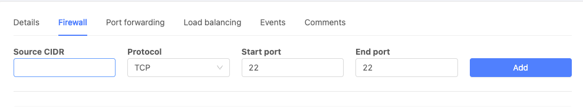

...and again for port 80

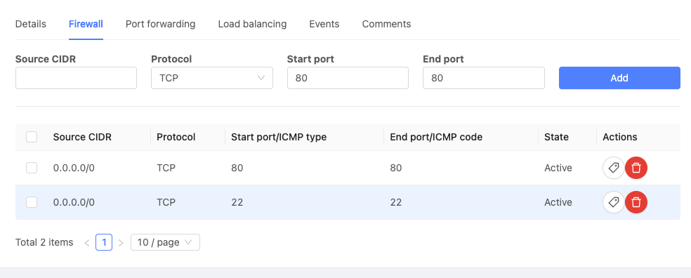

## SSH

Open windows powershell and ssh into your vm using `your own public ip`. Enter the following command:

!! DO NOT FORGET TO REPLACE 192.168.1.23 WITH YOUR OWN PUBLIC IP !!
```powershell
ssh cloud@192.168.1.23
```
If asked `Are you sure you want to continue connecting`, type *yes* and press *Enter*

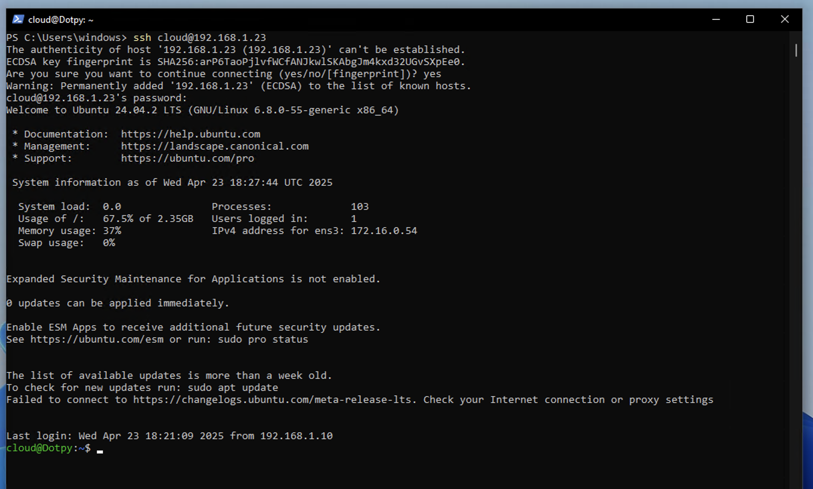

# Setup the Webserver
Copy and paste bellow in your terminal:

*You will be asked to enter your name, please do so and press enter*.
```bash
read -p "Enter your name: " name && \
sudo apt update && \
sudo apt install apache2 -y && \
sudo bash -c 'echo "<html><body style=\"display: flex; justify-content: center; align-items: center; height: 100vh; margin: 0; background-color: #e6f2ff;\"><div style=\"text-align: center; background-color: white; padding: 2rem; border-radius: 8px; box-shadow: 0 2px 4px rgba(0,0,0,0.1);\"><h1>Congratulations '"$name"'<br> You'\''ve successfully launched your first VM on the cloud!</h1></div></body></html>" > /var/www/html/index.html' && \
sudo systemctl start apache2 && \
sudo systemctl enable apache2 && \
echo -e 'Setup Complete!\nNext step is to test by running the following command: "curl localhost"'
```

# Test

```bash
curl localhost
```
Open your browser and enter `your public ip`.

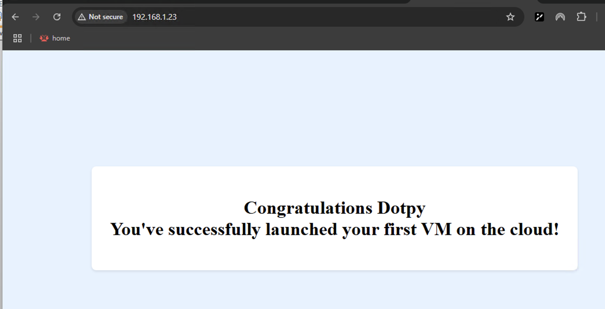

Final steps take proof and send to your instructor:
- take a screenshot of the browser

### Cleanup

- Make sure to clean up after yourself:
  - Remove your vm and delete the public ip.